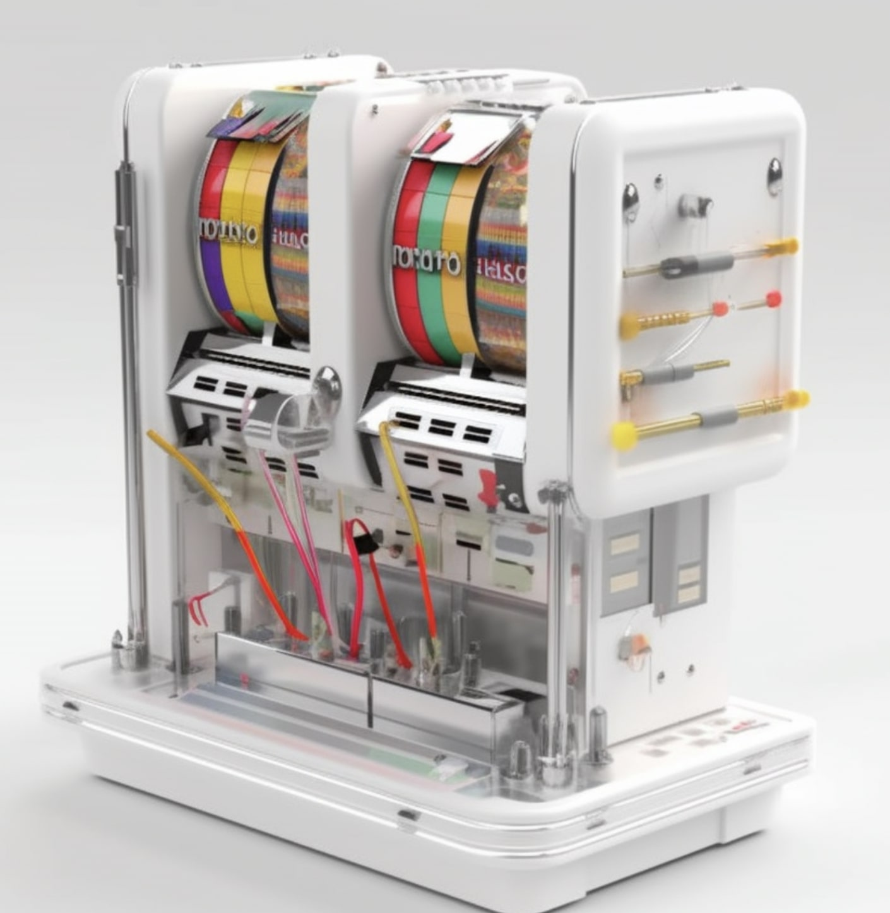

# SlotMachine.sol •  

SlotMachine is a specialized security testing library designed to detect hazardous storage writes in Solidity contracts. By leveraging the power of this innovative tool, developers can ensure their contracts maintain a high level of security and reliability.

### How does it work?

SlotMachine streamlines the testing process by performing the following steps:

Transpiling any Solidity contract to Yul using solc --via-ir
Injecting a Yul function into the file, responsible for logging
Injecting the logging function call into all Yul functions that implement the keccak calculation for a mapping
Compiling the Yul code into EVM bytecode
Attaching the SlotMachine contract to a predetermined address on the revm.
By simply inheriting from SlotMachine, developers can effortlessly create test cases that flag hazardous or unexpected SSTORE operations. This powerful tool not only enhances the security of your contracts but also provides invaluable insights into potential vulnerabilities.

### Usage

To ensure secure and efficient storage testing in your smart contracts, follow the steps below to effectively use SlotMachine:

Inherit from the SlotMachine contract in your Foundry tests.
Call super.setUp() to initiate SlotMachine.
Whitelist any storage positions and offsets that should be ignored by SlotMachine.
Deploy the target contract using deployContract(contractName).
Here is an example of how to structure your test contract:

### How to Use

To ensure secure and efficient storage testing in your smart contracts, follow the steps below to effectively use SlotMachine:

1. Inherit from the SlotMachine contract in your Foundry tests.
2. Call `super.setUp()` to initiate SlotMachine.
3. Whitelist any storage positions and offsets that should be ignored by SlotMachine.
4. Deploy the target contract using `deployContract(contractName)`.

Here is an example of how to structure your test contract:

```solidity
contract CounterStorageTest is SlotMachine {
    ICounter exampleContract;

    function setUp() public override {
        // setup SlotMachine
        super.setUp();
        // define the storage slot are 'OK' to be used by the target contract
        bytes32 defaultSlot = keccak256("counter.storage");
        slotWhitelist(defaultSlot, 100);

        // name of target contract
        string memory name = "Counter";
        // get the bytecode of the target contract, depliyed at this address
        exampleContract = ICounter(deployContract(name));
    }

    // write your tests here
    function testMapping() public useSlotMachine(address(exampleContract)) {
        exampleContract.setBalance();
    }
}
```


To execute the tests, run the following commands:
```bash
./slotmachine.sh Counter  # replace with your target contract name
forge test
```


The script will inject the following snipped in your target code:

```solidity
function fun__logSlot_1337(mappingSlot, mappingKey, keccakSlot) {

    /// @src 0:805:817  "0x11119696969696969696"
    let slotMachine_Addr := 0x11119696969696969696
    //    function logSlot(bytes32 slot, bytes32 key, bytes32 keccakResult) internal
    let functionHash := 0x05dfbcc06611f25ca8dbfdaa208a18820e782332ec41e97b86b3a65797df1cbd
    // let expr_70 := convert_t_bytes32_to_t_bytes4(expr_69)
    let functionSig := and(functionHash, 0xffffffff00000000000000000000000000000000000000000000000000000000)
    {
        let usr$ptr := mload(0x40)
        mstore(usr$ptr, functionSig)
        mstore(add(usr$ptr, 0x04), mappingSlot)
        mstore(add(usr$ptr, 0x24), mappingKey)
        mstore(add(usr$ptr, 0x44), keccakSlot)
        let usr$success := call(gas(), slotMachine_Addr, 0, usr$ptr, 0x64, 0, 0)
        if iszero(usr$success) { revert(0, 0) }
    }
}

```

And invoke the `fun__logSlot_1337()` for every mapping reference
```solidity
fun__logSlot_1337(slot,key,dataSlot)
```


In case of an SSTORE violation, you will receive an error message:

```
[FAIL. Reason: SLOTMACHINE_SSTORE_ALERT(0xed45ccd09931c6e422f2b385da45ff76edb71aea2a6e834fb421dde2ffe89b76)] testMapping() (gas: 1051182)
```

By running the tests in verbose mode using `forge test -vvvvv`, you can view all mapping SSTOREs for in-depth analysis.

```
forge test -vvvvv
[...]
--------
  
[SLOT] 0x0bec8ab077af1e12783ac8c970bca6dada042613c1ff87b4d0953dea6b011600 
[VALUE] 0x0000000000000000000000000000000000000000000000000000000000000000 
=> [keccack] 0x5935cfefbbd8605fc2d5027f8ea298804734a63f6e8acc97a88d646e14f53be0 [!OK!]
  

--------
  
[SLOT] 0x5935cfefbbd8605fc2d5027f8ea298804734a63f6e8acc97a88d646e14f53be0 
[VALUE] 0x0000000000000000000000000000000000000000000000000000000000000000 
=> [keccack] 0xe0a0cdcf88a393a2db0b6bdb7abb6d52da1e1500c3523dc023b9046db782d20f [!OK!]
  

--------
  
[SLOT] 0x2031468f0c30f7087de4da9398818763b546d7f89935fa65485c24ff1df26bf4 
[VALUE] 0x0000000000000000000000000000000000000000000000000000000000077777 
=> [keccack] 0xed45ccd09931c6e422f2b385da45ff76edb71aea2a6e834fb421dde2ffe89b76 [!ALERT!]
```


### Disclaimer

_These smart contracts are being provided as is. No guarantee, representation or warranty is being made, express or implied, as to the safety or correctness of the user interface or the smart contracts. They have not been audited and as such there can be no assurance they will work as intended, and users may experience delays, failures, errors, omissions, loss of transmitted information or loss of funds. The creators are not liable for any of the foregoing. Users should proceed with caution and use at their own risk._

See [LICENSE](./LICENSE) for more details.
